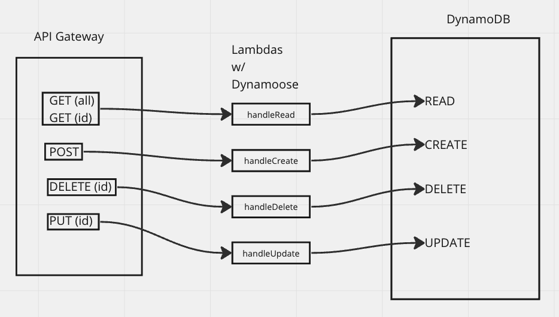

# serverless-api

### Problem Domain
Create a serverless REST API, constructed using API Gateway and DynamoDB.

### Links and Resources
- [GitHub PR](https://github.com/modopo/serverless-api/pull/3)

### Features / URL

URL: https://x7kaq927ye.execute-api.us-west-2.amazonaws.com/dev/1

- POST : /employee - Given a JSON body, inserts a record into the database.

  - returns an object representing one record

- GET (all): /employee/:id OR /employee- returns an array of objects representing the records in the database.

- GET : /employee/:id - returns an object representing one record, by id.

- PUT : /people/:id - Given a JSON body and an ID (##), updates a record in the database.

  - returns an object representing updated employee

- DELETE : /people/:id - Given an idm removes the matching record from the database.

### UML
